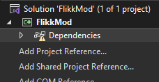

# FLIKK Modding
A guide and template to create a FLIKK mod

## Prerequisites
this should really be obvious, you should already know C# as well as be familiar with Visual Studio and how to use it

## Getting Started
1. Open Visual Studio (duh) and go to Tools -> Get Tools and Features (when in a project) \


1. Select .NET desktop devlopment from the list of features\

1. After that's installed make a new project, search for "Class Library" and choose "Class Library - A project for creating a class library that targets .NET or .NET Standard" \
 \
⚠️ Make sure it's not the Visual Basic class library (note the "C#" in the corner of the image)

## Mod setup
1. Name the mod whatever you want and type something like this (In your main cs file, called Class1.cs by default). Replace FlikkMod with the name of your mod, the public class can be whatever you want though, but Main has to be kept as that.
    ```cs
    using UnityEngine;

    namespace FlikkMod
    {
        public class FlikkMod
        {
            public object Main()
            {
                Debug.Log("skibidi oilet");
                return 0;
            }
        }
    }
    ```

1. Link Unity DLLs \
    - This can either be done manually or automatically, though probably do it manually because I dont know if the template works
    

    - To do it automatically, go to [generator/template.csproj](https://github.com/undefined06855/FlikkModding/blob/main/generator/template.csproj) and replace the current csproj file of the solution with this file - being sure to define the variables at the top of the file

    - To do it manually (recommended) right click on the Dependencies in your project and click Add Project Reference button \
     \
    Then click "Browse..." in the bottom right of the dialog that pops up, then select all the DLLs in the FLIKK folder at FLIKK\FLIKK_Data\Managed\
    - There's probably going to be some errors since not all of those DLLs can be used as references but don't worry it's fine
    - Then open the `.csproj` file in the root of the project folder, and add the following after the first `</PropertyGroup>`:
        ```csproj
        <Target Name="CopyOutput" AfterTargets="Build">
            <Copy SourceFiles="$(OutputPath)\$NAME.dll" DestinationFolder="$FLIKKMODSFOLDER" />
        </Target> 
        ```
        Make sure to replace $NAME.dll with the name of your built DLL, and replacing $FLIKKMODSFOLDER with the path of your FLIKK mods folder.
    - If that doesn't automatically move the DLL into your mods folder after building then bad luck lol, you have to copy it yourself

## Building
just press ctrl+b or ctrl+shift+b or something
